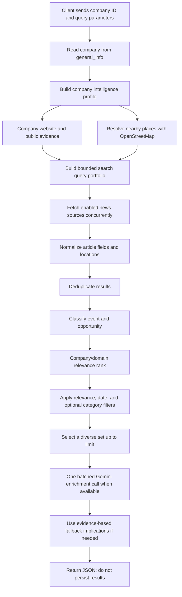

# Company Developments API

This module retrieves current external news and business developments relevant to a company. It uses the company profile in the existing `general_info` table, searches external sources on each request, ranks and enriches the results, and returns them as JSON. It does not save article results or create a developments table.

## Endpoint

```http
GET /api/v1/developments/{company_id}?limit=10&days=7
```

Example:

```http
GET /api/v1/developments/84840060-25b4-4550-9e3c-f840d857c697?limit=10&days=7
```

| Parameter | Default | Allowed values | Description |
| --- | ---: | --- | --- |
| `company_id` | — | UUID | ID of a company in `general_info`. |
| `limit` | `10` | 1–20 | Maximum number of returned items. This is a cap, not a guarantee: the API can return fewer if fewer candidates pass retrieval and relevance filters. |
| `days` | `7` | 1–30 | Recency window used by sources and the final date filter. |
| `category` | omitted | string | Optional exact category/event-type filter; can reduce the number of results. |

The route is registered in `main.py` under `/api/v1/developments`; the company-specific route is in `routes.py`.

## End-to-end workflow



### 1. Company profile and context

The service reads the company name, city, state, business category/type, and website from `general_info`. Company intelligence can use the company website and public company-search evidence to identify domains, products/services, technologies, competitors, and related terms. Deterministic evidence is used first; Gemini company-profile enrichment is used when the profile needs it. Profile enrichment is skipped when the deterministic profile already has sufficient domains and technologies/products.

Nearby locations are optionally resolved from OpenStreetMap Nominatim and Overpass. A lookup failure or timeout does not stop the news search; it simply leaves nearby-place terms empty. Nearby place data informs searches and ranking and is not itself a news source.

### 2. Query portfolio

`development/query/query_builder.py` creates a bounded set of searches across the company name, verified business domains, technologies, competitors (when identified), city, state, nearby towns, government programs/tenders, regulation, investment, infrastructure, national coverage, and global sector developments. The portfolio is balanced so one search family does not take all query slots. The default is up to 24 queries; `limit` can raise the internal cap, up to 30.

The generated query count is not the number of returned articles. Each enabled source is queried with each generated search, and each response is capped before normalization.

### 3. Sources

Live sources are selected in `development/service.py`; source metadata and request templates are in [india_developments_data_sources.json](india_developments_data_sources.json).

| Source | Enabled when | Notes |
| --- | --- | --- |
| GDELT DOC | `DEVELOPMENTS_GDELT_ENABLED` is not `0`, `false`, or `no` (default enabled) | Public news search API. Requests include the selected `days` window. |
| Google News RSS | `DEVELOPMENTS_GOOGLE_NEWS_ENABLED` is not `0`, `false`, or `no` (default enabled) | Public RSS search. Queries include a `when:{days}d` recency term. |
| NewsAPI | `NEWSAPI_KEY` is set | Optional provider; requests use the selected `days` window. |
| The Guardian API | `THE_GUARDIAN_API_KEY` or `GUARDIAN_API_KEY` is set | Optional provider; requests use the selected `days` window. |

Configured state procurement portals are reference metadata only. This service does not currently scrape those portals. A source appears in the response `sources` list only if it contributed results to that response. Source outages, timeouts, provider quotas, and empty searches can therefore reduce coverage.

Source calls run concurrently with bounded concurrency and timeouts. Repeated failures open a per-request circuit breaker for that source so remaining work can finish. A source failure is logged and does not discard results from other sources.

### 4. Normalize, classify, deduplicate, and rank

Results are normalized into a common article shape. Recognized city/state names are extracted from the article text; the company's own location is not assigned to an article without textual evidence. Duplicate URLs and repeated/near-identical headlines are collapsed before ranking.

Articles are classified into available development families such as company, domain, local, nearby, state, government, tender, competitor, technology, regulatory, infrastructure, investment, global, or opportunity. Relevance combines company/domain evidence, geography, recency, source authority, and result completeness. Items must match company or business-domain evidence (or qualify as an evidence-backed opportunity) and meet the configured minimum relevance score. The service then applies the requested date window and optional `category` filter.

Selection uses the configured category mix as a preference and fills remaining slots from other qualifying candidates. If only three unique candidates remain after these steps, the API returns three even when `limit=10`; it does not fabricate or pad items.

### 5. Opportunity scoring and Gemini enrichment

Opportunity classification and score start from article evidence. A tender/RFP/RFQ/EOI classification requires procurement evidence; a general sector story is not automatically treated as a direct tender. Opportunity scores are kept consistent with the evidence and relevance.

When Gemini is configured and available, selected items are sent in one batch for concise `what_happened`, company-aware implication, and opportunity enrichment. The response is parsed against the expected batch shape. If the call fails or its output cannot be parsed, the service builds a cautious fallback implication from the company's verified domains and the article. Fallback wording does not assert a contract or guaranteed benefit.

## Response shape

```json
{
  "company": {
    "id": "...",
    "name": "Example Company",
    "city": "Bengaluru",
    "state": "Karnataka",
    "business_category": "Technology & IT"
  },
  "company_context": {
    "industry": "Consulting & Professional Services",
    "business_domains": ["consulting", "cybersecurity"],
    "technologies": ["Cybersecurity"]
  },
  "retrieved_at": "2026-10-01T04:57:58Z",
  "sources": ["Google News RSS"],
  "items": [
    {
      "title": "Example development",
      "summary": "Source-provided summary",
      "what_happened": "Short description of the report",
      "implication": "Conditional company-specific implication",
      "source_name": "Example publisher",
      "source_url": "https://example.com/story",
      "published_at": "2026-09-30T10:00:00Z",
      "city": null,
      "state": null,
      "location": {"city": null, "state": null},
      "category": "technology",
      "development_type": "technology",
      "event_type": "technology",
      "opportunity_type": "none",
      "opportunity_relevance": "none",
      "business_opportunity_score": 0.0,
      "relevance": "medium",
      "relevance_score": 0.62
    }
  ]
}
```

`sources` identifies providers that returned candidates, while each item's `source_name` identifies its publisher. The API performs a fresh search per request and does not persist the response.

## Configuration

The following environment variables can tune or enable this workflow. Defaults are shown where defined in code.

| Variable | Default | Purpose |
| --- | --- | --- |
| `DEVELOPMENTS_GDELT_ENABLED` | `true` | Enable GDELT source. |
| `DEVELOPMENTS_GOOGLE_NEWS_ENABLED` | `true` | Enable Google News RSS. |
| `NEWSAPI_KEY` | unset | Enable NewsAPI. |
| `THE_GUARDIAN_API_KEY` / `GUARDIAN_API_KEY` | unset | Enable Guardian API. |
| `GEMINI_API_KEY` | unset | Enable Gemini enrichment through the configured Gemini service. |
| `DEVELOPMENTS_NEARBY_ENABLED` | `true` | Enable nearby-place lookup. |
| `DEVELOPMENTS_MAX_QUERIES` | `24` | Base query portfolio cap; request limit can raise this up to 30. |
| `DEVELOPMENTS_MAX_RESULTS_PER_QUERY` | `8` | Maximum records retained from each source/query response. |
| `DEVELOPMENTS_MAX_GEMINI_CANDIDATES` | `20` | Maximum selected items passed to batch enrichment. |
| `DEVELOPMENTS_MIN_RELEVANCE_SCORE` | config value `0.38` | Minimum ranked relevance score. |
| `DEVELOPMENTS_SOURCE_TIMEOUT` | `3.5` seconds | Timeout for non-GDELT news source calls. |
| `DEVELOPMENTS_GDELT_TIMEOUT` | `1.5` seconds | Service-level GDELT timeout. |
| `DEVELOPMENTS_SOURCE_CONCURRENCY` | `10` | Concurrent calls per non-GDELT source. |
| `DEVELOPMENTS_GDELT_CONCURRENCY` | `6` | Concurrent GDELT calls. |
| `DEVELOPMENTS_GEMINI_TIMEOUT` | `24` seconds | Timeout for the batch insight call. |

The category mix, nearby location cap, and default minimum score are in `company_aware_scoring` in [india_developments_data_sources.json](india_developments_data_sources.json).

## Debugging low result counts

`limit=10` means **up to ten**, not exactly ten. Check the actual request URL first; a `limit=3` or restrictive `category` can explain a short list. If the request uses `limit=10` without a category, inspect the service logs for:

- `Development source retrieval results`: candidate counts by provider and source retrieval time.
- `Development pipeline counts`: `raw`, `normalized`, `deduplicated`, `relevant`, `within_requested_days`, and `selected` counts.
- `Development ranking completed`: number ranked and number above the relevance threshold.
- `Development queries generated`: query count by search family.
- `Development source ... request failed` and circuit-breaker warnings: source/API availability.

Interpret the counts in order: few raw results points to source/query coverage; a large deduplication drop points to repeated stories; a relevance drop points to weak company/domain matches; a date drop points to stale or unparseable dates; a category drop can be caused by the optional request filter. The response `sources` list can confirm whether only one provider contributed.

## Operational notes

- Developments are fetched on demand; there is no background crawler, cache, or historical store in this module.
- No development-specific database table or migration is required. Company lookup uses the existing `general_info` table.
- Nearby-place resolution and external sources can be unavailable independently; failures are logged and the request can still return results from sources that work.
- Search coverage and publication timing depend on upstream providers. The API cannot guarantee that ten qualifying articles exist for every company and date window.
- The tests for this workflow are in `tests/test_developments.py` and `tests/test_developments_intelligence.py`.
